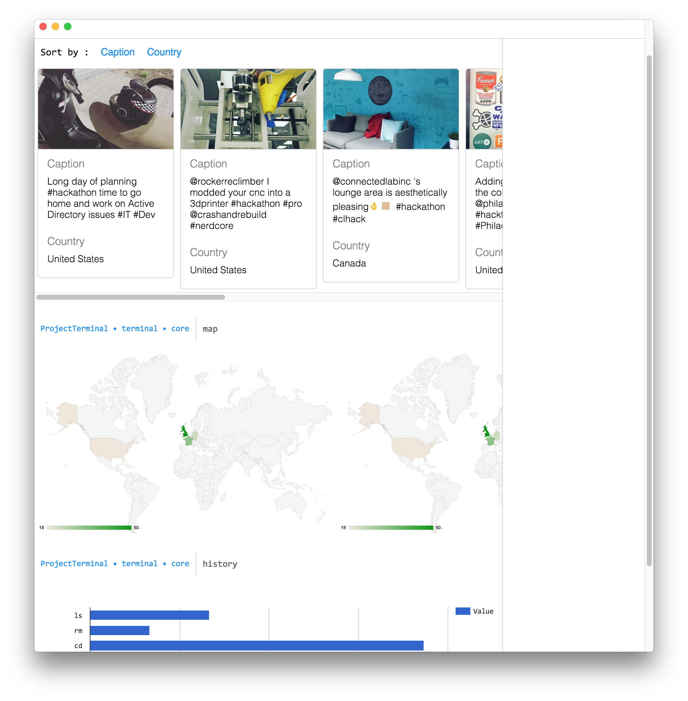
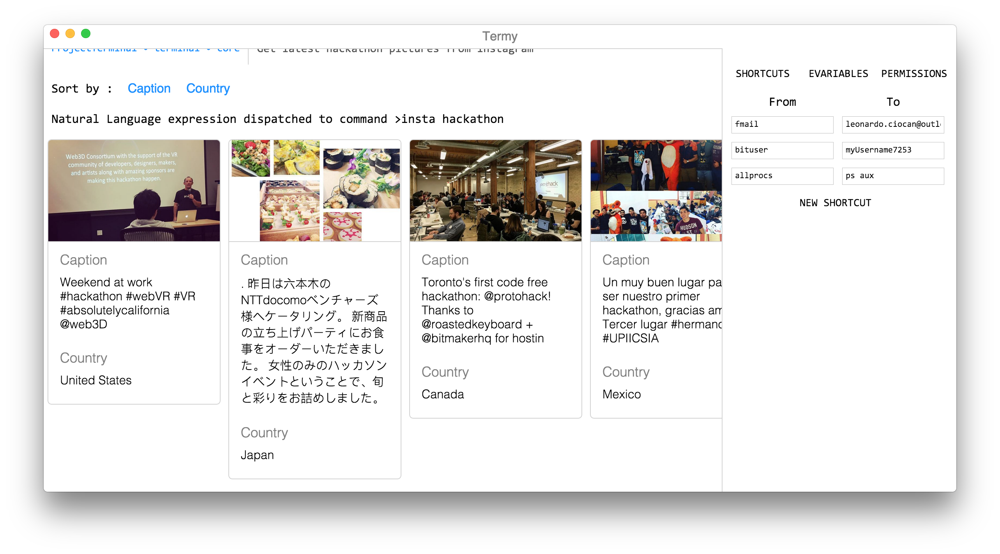

# Termy

A terminal that pipes objects instead of text and uses the extra information provided by the objects to help the user visualize the data.

Made for the Facebook London Hackathon 2016

Uses `react` and `electron`

